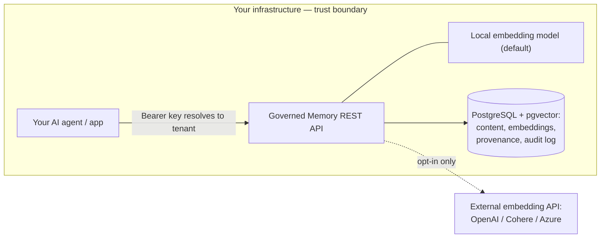

# Security & Data Handling Overview

> Governed Memory is open-source and **self-hosted**: it runs entirely inside your own
> infrastructure. This document explains how it handles data, what does and does not leave
> your environment, and how tenant isolation and the audit trail work — the questions a
> security review asks before an AI agent is allowed to act on customer data.
>
> Scope: the self-hosted OSS engine — the `core/` library, the REST API, and the Python SDK.
> To report a vulnerability, see [SECURITY.md](../SECURITY.md).

## Posture at a glance

| | |
|---|---|
| **Deployment** | 100% self-hosted (Docker/Compose today; Helm chart planned). No SaaS dependency. |
| **Data location** | One PostgreSQL database that you operate. Nothing is stored outside it. |
| **Outbound network** | **None by default.** No telemetry, analytics, error reporting, or update checks. |
| **Multi-tenancy** | Enforced in the data layer, keyed off the caller's API key. |
| **Audit** | Append-only, SHA-256 hash-chained, independently verifiable (tamper-evident). |
| **Maturity** | Pre-1.0, MIT-licensed. See [Current limitations](#current-limitations--roadmap). |

## Deployment & trust boundary

You run the whole stack — the REST API, PostgreSQL (with the `pgvector` extension), and the
web console — in your own environment via `deploy/docker-compose.yml`. The database can be the
bundled Postgres container or any managed Postgres you already trust (AWS RDS, GCP Cloud SQL,
Azure, Supabase, Neon), pointed to through a single `DATABASE_URL`.

Everything inside the box runs in your environment. The single dashed edge is the *only* way
any content can leave — and it is off unless you deliberately enable it (see
[What crosses the boundary](#what-crosses-the-boundary)).

## Where data lives

All state — memory content, vector embeddings, provenance/lineage, policies, and the audit
log — lives in your PostgreSQL database and nowhere else. In the self-hosted deployment there
is no Governed Memory-operated cloud service; no data is sent to Metaworkers.

## What crosses the boundary

**By default: nothing.** The shipped REST server computes embeddings with a **local** model
(`SentenceTransformer`, or a zero-vector fallback if the optional model isn't installed) — it
never calls out. The engine sends no telemetry, usage analytics, error reports, or
update-check traffic of any kind.

The **only** way content can leave your environment is if you deliberately configure an
external embedding provider (OpenAI, Cohere, or Azure OpenAI). These providers exist in the
library but are **not wired into the default server** — enabling one is an explicit operator
choice that requires installing that SDK and setting its API key. When enabled, the text being
embedded (at write and query time) is sent to that provider under your own account and terms;
nothing else is.

## Tenant isolation

Multi-tenant separation is enforced in the data layer, not left to application discipline:

- Every API request authenticates with an `Authorization: Bearer <key>` token that maps to
  **exactly one** tenant. The tenant identity is resolved from the key server-side and is
  **never** read from the request body — callers cannot name a tenant, so they cannot request
  another tenant's data.
- Every database query is scoped with `WHERE tenant_id = ...` using parameterized statements
  (psycopg2), across all reads, writes, deletes, and cascade purges. Parameterization also
  closes SQL injection as a class.
- A cross-tenant read returns nothing — not an error that leaks a record's existence.

## Authentication & authorization

Authentication is a per-tenant API key — a set of `tenant:key` pairs supplied as configuration
(`GOVERNEDMEMORY_API_KEYS`); there is no key database and no admin UI, in keeping with the
"self-host, zero extra infra" design. Every data route requires a valid key; only the
unauthenticated `/healthz` liveness probe does not.

This is deliberately simple for a self-hosted engine. It is **API-key authentication, not
SSO/OIDC or fine-grained RBAC** — those belong to the managed/enterprise offering and are on
the roadmap, not in the OSS core today. Key issuance, rotation, and TLS termination are handled
by your surrounding infrastructure.

## Injection & poisoning defense (the core control)

Governed Memory exists to keep an agent from acting on memory it shouldn't trust:

- **Taint on write** — every write is scored for prompt-injection patterns and labeled
  `trusted`, `untrusted`, or `quarantined` *before* it is stored, regardless of what the source
  claims to be. Detection defaults to an explainable heuristic scanner, with an optional trained
  ML classifier and an `ensemble` mode (selectable via `DETECTION_BACKEND`).
- **Privilege-gated retrieval** — untrusted and quarantined memory is held out of ordinary
  retrieval unless explicitly requested, and a policy engine can require that a given purpose
  (e.g. issuing a refund) only draw on sources that clear a bar you set.

## Tamper-evident audit

Every write, retrieve, quarantine, purge, and policy decision emits one append-only audit
event. Each event stores `hash = SHA-256(prev_hash + payload)`, chaining it to the previous
event for that tenant. The verifier recomputes each event's hash from its stored fields, so it
detects both a deleted or reordered event (linkage break) **and** an in-place edit of an
existing row (hash mismatch). The log is retrievable via `GET /v1/audit`.

To be precise: this makes the trail **tamper-evident (detective)**, not tamper-proof. The table
is append-only *by convention*; integrity is *verifiable* rather than enforced by a database
trigger. Someone with direct write access to your database could alter a row — verification is
what surfaces that it happened.

## Secrets & configuration

All secrets — the database DSN, API keys, and any optional embedding-provider keys — are
supplied via environment variables; none are baked into the container images (see
`deploy/.env.example`). Transport encryption (TLS) and encryption-at-rest are provided by your
infrastructure and database, as with any self-hosted service.

## Current limitations & roadmap

Named plainly, because a credible security review should see the edges:

- **Pre-1.0.** Under active development; security fixes land on `main` (no maintained release
  branches yet).
- **Audit is tamper-evident, not tamper-proof** — detective via verification, not
  database-enforced immutability.
- **Auth is API-key based** — SSO/OIDC and fine-grained RBAC are enterprise/roadmap, not in the
  OSS core.
- **No SOC 2 report yet** — a Type-I controls document is planned for pilot security reviews; a
  full audit is a post-funding activity.
- **Encryption at rest / in transit is operator-provided** — inherited from your database and
  ingress, not implemented by the engine.

## Reporting a vulnerability

Please don't open a public issue for security vulnerabilities. See [SECURITY.md](../SECURITY.md)
for responsible-disclosure instructions.
